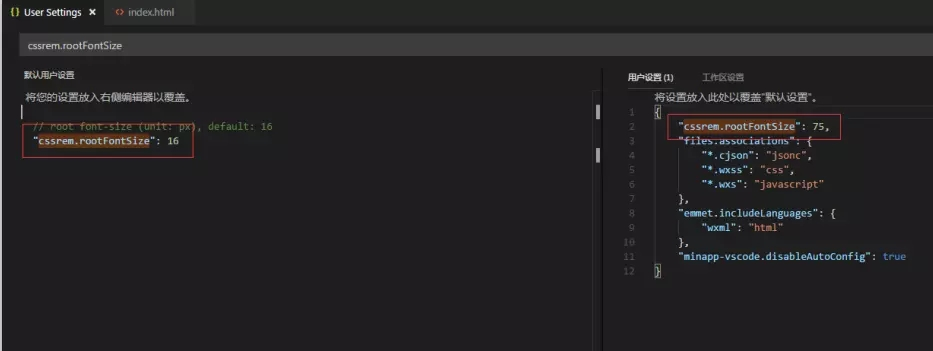

## 三种（rem）移动端适配方案

1. 媒体查询。

2. js 动态设置 html 的 font-size（rem 为单位）。

3. 淘宝提供的解决方案 flexible.js（rem 为单位）。

#### 媒体查询

优点：

1. 方法简单，成本低，移动和 PC 维护同一套代码。

2. 只用修改 css 文件。

缺点：

1. 代码量大，维护不方便。

2. 为兼顾大屏或高清设备，会造成其他资源浪费，特别是加载图片资源。

3. 为了兼顾移动端和 PC 端各自响应式的展示效果，难免会损失各自特有的交互方式。

#### js 动态设置 html 的 font-size

1. 设置 meta viewport 属性

    ```html
    <meta name="viewport" content="width=device-width, user-scalable=no, initial-scale=1.0, minimum-scale=1.0, maximum-scale=1.0" />
    ```

2. 添加动态设置 html 的 font-size 的 js

    ```js
    (function(doc, win) {
        var docEl = doc.documentElement,
            resizeEvt = 'orientationchange' in window ? 'orientationchange' : 'resize',
            recalc = function() {
                var clientWidth = docEl.clientWidth;
                if (!clientWidth) return;
            // 设置设计稿的宽度clientWidth为750
                if (clientWidth >= 750) {
                    docEl.style.fontSize = '75px';
                } else {
                    // 设置设计稿的宽度clientWidth为750
                    docEl.style.fontSize = 75 * (clientWidth / 750) + 'px';
                };
            };
        if (!doc.addEventListener) return;
        win.addEventListener(resizeEvt, recalc, false);
        doc.addEventListener('DOMContentLoaded', recalc, false);
    })(document, window);
    ```

#### 淘宝提供的解决方案 flexible.js

这个解决方案只解决苹果设备上的 dpr 为2和3的情况，不考虑安卓设备也不考虑 pad。

1、设置 meta 标签。

```html
<meta content="yes" name="apple-mobile-web-app-capable" />
<meta content="yes" name="apple-touch-fullscreen" />
<meta content="telephone=no,email=no" name="format-detection" />
<meta content="maximum-dpr=2" name="flexible" />
```

2、引入 flexible.js 文件。

```js
<script src="[http://g.tbcdn.cn/mtb/lib-flexible/0.3.4/??flexible_css.js,flexible.js](http://g.tbcdn.cn/mtb/lib-flexible/0.3.4/??flexible_css.js,flexible.js)"></script>
```

3、把设计稿中的px转化为rem

但在实际开发中, 借助一个工具cssrem. 通过vscode开发工具下载cssrem插件,然后在设置里面找到cssrem.rootFontSize, 把数值设为75(一般情况下移动端设计稿默认是750, 1rem就是75px, 可根据设计稿尺寸自行调整)




案列代码如下：

```html
<!DOCTYPE html>
<html lang="en">
    <head>
        <meta charset="utf-8">
        <meta content="yes" name="apple-mobile-web-app-capable">
        <meta content="yes" name="apple-touch-fullscreen">
        <meta content="telephone=no,email=no" name="format-detection">
        <script src="http://g.tbcdn.cn/mtb/lib-flexible/0.3.4/??flexible_css.js,flexible.js"></script>
        <!-- <link rel="apple-touch-icon" href="favicon.png">
        <link rel="Shortcut Icon" href="favicon.png" type="image/x-icon"> -->
        <title>再来一波</title>
    </head>
    <body>
        <div class="item-section" data-repeat="sections">
            <div class="item-section_header">
                <h2></h2>
            </div>
            <ul>
                <li data-repeat="items" class="flag" role="link" href="{itemLink}">
                    <div class="figcaption flag-item">
                        <div class="flag-title"><a href="{itemLink}" title="">Carter's1年式灰色长袖连体衣包脚爬服全棉鲸鱼男婴儿童装115G093</a></div>
                        <div class="flag-price"><span>双11价</span><strong>¥299.06</strong><small>(满400减100)</small></div>
                        <div class="flag-type">1小时内热卖5885件</div>
                        <a class="flag-btn" href="{shopLink}">{activeName}</a>
                    </div>
                </li>
            </ul>
        </div>
    </body>
    <style>
        .flag-type{
            margin-top: 10rem;
        }
        
    </style>
</html>
```

#### 封装rem和viewoint两种情况适配

移动端布局主要分为以下四种（纯粹的移动端，不考虑pc）：

1. 百分比布局

2. rem（荐）

3. viewoint（荐）

4. 无宽布局

##### 将rem和viewoint两种情况适配的函数封装成以下js文件；代码如下

```js
/**
 * 
 * 该 JS 中，包含常用的 UA 判断、页面适配、search 参数转 键值对。
 * 该 JS 应在 head 中尽可能早的引入，减少重绘。
 *
 * fixScreen 方法根据两种情况适配，该方法自动执行。
 *      1. 定宽： 对应 meta 标签写法 -- 
            <meta name="viewport" content="width=750">
 *         该方法会提取 width 值，主动添加 scale 相关属性值。
 *         注意： 如果 meta 标签中指定了 initial-scale， 该方法将不做处理（即不执行）。
 *      
 *      2. REM: 不用写 meta 标签，该方法根据 dpr 自动生成，并在 html 标签中加上 data-dpr 和 font-size 两个属性值。
 *         该方法约束：IOS 系统最大 dpr = 3，其它系统 dpr = 1，页面每 dpr 最大宽度（即页面宽度/dpr） = 750，REM 换算比值为 16。
 *         对应 css 开发，任何弹性尺寸均使用 rem 单位，rem 默认宽度为 视觉稿宽度 / 16;
 *         scss 中 $ppr(pixel per rem) 变量写法 -- $ppr: 750px/16/1rem;
 *         元素尺寸写法 -- html { font-size: $ppr*1rem; } body { width: 750px/$ppr; }。
   
 */
window.mobileUtil = (function(win, doc) {
	var UA = navigator.userAgent,
		isAndroid = /android|adr/gi.test(UA),
		isIos = /iphone|ipod|ipad/gi.test(UA) && !isAndroid, // 据说某些国产机的UA会同时包含 android iphone 字符
		isMobile = isAndroid || isIos;  // 粗略的判断

	return {
		isAndroid: isAndroid,
		isIos: isIos,
		isMobile: isMobile,

        isNewsApp: /NewsApp\/[\d\.]+/gi.test(UA),
		isWeixin: /MicroMessenger/gi.test(UA),
		isQQ: /QQ\/\d/gi.test(UA),
		isYixin: /YiXin/gi.test(UA),
		isWeibo: /Weibo/gi.test(UA),
		isTXWeibo: /T(?:X|encent)MicroBlog/gi.test(UA),

		tapEvent: isMobile ? 'tap' : 'click',

		/**
		 * 缩放页面
		 */
		fixScreen: function() {
            var metaEl = doc.querySelector('meta[name="viewport"]'),
                metaCtt = metaEl ? metaEl.content : '',
                matchScale = metaCtt.match(/initial\-scale=([\d\.]+)/),
			    matchWidth = metaCtt.match(/width=([^,\s]+)/);

            if ( !metaEl ) { // REM
                var docEl = doc.documentElement,
                    maxwidth = docEl.dataset.mw || 750, // 每 dpr 最大页面宽度
                    dpr = isIos ? Math.min(win.devicePixelRatio, 3) : 1,
                    scale = 1 / dpr,
                    tid;

                docEl.removeAttribute('data-mw');
                docEl.dataset.dpr = dpr;
                metaEl = doc.createElement('meta');
                metaEl.name = 'viewport';
                metaEl.content = fillScale(scale);
                docEl.firstElementChild.appendChild(metaEl);

                var refreshRem = function() {
                    var width = docEl.getBoundingClientRect().width;
                    if (width / dpr > maxwidth) {
                        width = maxwidth * dpr;
                    }
                    var rem = width / 16;
                    docEl.style.fontSize = rem + 'px';
                };

                win.addEventListener('resize', function() {
                    clearTimeout(tid);
                    tid = setTimeout(refreshRem, 300);
                }, false);
                win.addEventListener('pageshow', function(e) {
                    if (e.persisted) {
                        clearTimeout(tid);
                        tid = setTimeout(refreshRem, 300);
                    }
                }, false);

                refreshRem();
            } else if ( isMobile && !matchScale && ( matchWidth && matchWidth[1] != 'device-width' ) ) { // 定宽
                var	width = parseInt(matchWidth[1]),
                    iw = win.innerWidth || width,
                    ow = win.outerWidth || iw,
                    sw = win.screen.width || iw,
                    saw = win.screen.availWidth || iw,
                    ih = win.innerHeight || width,
                    oh = win.outerHeight || ih,
                    ish = win.screen.height || ih,
                    sah = win.screen.availHeight || ih,
                    w = Math.min(iw,ow,sw,saw,ih,oh,ish,sah),
                    scale = w / width;

                if ( scale < 1 ) {
                    metaEl.content = metaCtt + ',' + fillScale(scale);
                }
            }

            function fillScale(scale) {
                return 'initial-scale=' + scale + ',maximum-scale=' + scale + ',minimum-scale=' + scale + ',user-scalable=no';
            }
		},

		/**
		 * 转href参数成键值对
		 * @param href {string} 指定的href，默认为当前页href
		 * @returns {object} 键值对
		 */
		getSearch: function(href) {
			href = href || win.location.search;
			var data = {},reg = new RegExp( "([^?=&]+)(=([^&]*))?", "g" );
			href && href.replace(reg,function( $0, $1, $2, $3 ){
				data[ $1 ] = $3;
			});
			return data;
		}
	};
})(window, document);

// 默认直接适配页面
mobileUtil.fixScreen();
```
