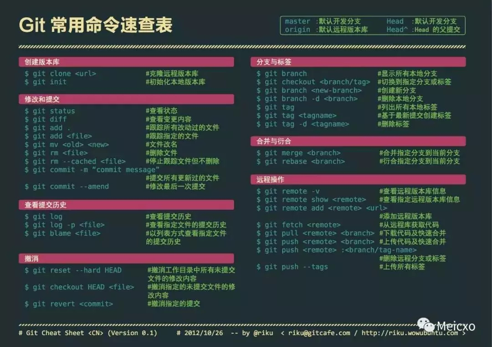
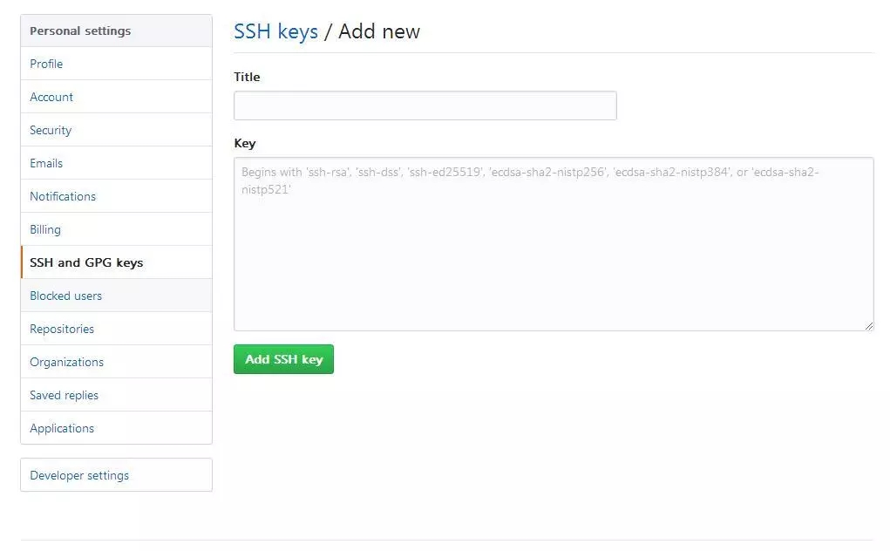

## git笔记

> git是一个分布式的版本控制软件。版本控制是一种记录一个或若干文件内容变化，以便将来查阅特定版本修订情况的系统。



#### 一. 安装配置

##### 安装

直接下载安装包：[https://gitforwindows.org/](https://gitforwindows.org/)


##### 用户名和邮箱配置

设置你的用户名称与邮件地址。 这样做很重要，因为每一个 Git 的提交都会 使用这些信息，并且它会写入到你的每一次提交中。

```bash
$ git config --global user.name "****"
$ git config --global user.name *********@***.com
```

##### 配置SSH

Git 服务器大部分都使用 SSH 公钥进行认证,其他认证方式都不方便，创建SSH公钥的方法。

默认情况下，用户的 SSH 密钥存储在其 ***~/.ssh***  目录下。 

```bash
//生成密钥
$ ssh-keygen -t rsa -C "*********@***.com"
```

登陆Github, 把 ***id_rsa.pub***文件里的内容复制到 ***ssh key***



#### 二. 分支管理

假设你准备开发一个新功能，但是需要两周才能完成，第一周你写了50%的代码，如果立刻提交，由于代码还没写完，不完整的代码库会导致别人不能干活了。如果等代码全部写完再一次提交，又存在丢失每天进度的巨大风险。

现在有了分支，就不用怕了。你创建了一个属于你自己的分支，别人看不到，还继续在原来的分支上正常工作，而你在自己的分支上干活，想提交就提交，直到开发完毕后，再一次性合并到原来的分支上，这样，既安全，又不影响别人工作。

##### 创建与合并分支

```bash
查看分支：git branch

创建分支：git branch <name>

切换分支：git checkout <name>

创建+切换分支：git checkout -b <name>

合并某分支到当前分支：git merge <name>

删除分支：git branch -d <name>
```

Git告诉我们合并某分支到当前分支的***Fast-forward***信息，这次合并是“快进模式”，也就是直接把master指向dev的当前提交，所以合并速度非常快。

##### 分支管理策略

通常，合并分支时，如果可能，Git会用Fast forward模式，但这种模式下，删除分支后，会丢掉分支信息。

如果要强制禁用Fast forward模式，Git就会在merge时生成一个新的commit，这样，从分支历史上就可以看出分支信息。

合并分支时，加上--no-ff参数就可以用普通模式合并，合并后的历史有分支，能看出来曾经做过合并，而fast forward合并就看不出来曾经做过合并。

```bash
// --no-ff方式的git merge表示禁用Fast forward;
$ git merge --no-ff -m "merge with no-ff" dev
```

在实际开发中，我们应该按照几个基本原则进行分支管理：

首先，master分支应该是非常稳定的，也就是仅用来发布新版本，平时不能在上面干活；

那在哪干活呢？干活都在dev分支上，也就是说，dev分支是不稳定的，到某个时候，比如1.0版本发布时，再把dev分支合并到master上，在master分支发布1.0版本；

你和你的小伙伴们每个人都在dev分支上干活，每个人都有自己的分支，时不时地往dev分支上合并就可以了。

##### Bug分支

在Git中，由于分支是如此的强大，所以，每个bug都可以通过一个新的临时分支来修复，修复后，合并分支，然后将临时分支删除。

当你接到一个修复一个代号101的bug的任务时，创建一个分支***issue-101***来修复它，但是当前正在dev上进行的工作还没有提交;不是你不想提交，而是工作只进行到一半，还没法提交，预计完成还需1天时间。但是，必须在两个小时内修复该bug，怎么办？

Git还提供了一个stash功能，可以把当前工作现场“储藏”起来，等以后恢复现场后继续工作：

```bash
$ git stash
Saved working directory and index state WIP on dev: f52c633 add merge
```
现在，用git status查看工作区，就是干净的（除非有没有被Git管理的文件），因此可以放心地创建分支来修复bug;

首先确定要在哪个分支上修复bug，假定需要在master分支上修复，就从master创建临时分支

修复完成后，切换到master分支，并完成合并，最后删除***issue-101***分支：

```bash
$ git checkout master
$ git merge --no-ff -m "merged bug fix 101" issue-101
```
修复后，再***git stash pop***，回到工作现场。

##### Feature分支

软件开发中，总有无穷无尽的新的功能要不断添加进来。

添加一个新功能时，你肯定不希望因为一些实验性质的代码，把主分支搞乱了，所以，每添加一个新功能，最好新建一个feature分支，在上面开发，完成后，合并，最后，删除该feature分支。

```bash
$ git checkout -b feature-vulcan
```

一切顺利的话，feature分支和bug分支是类似的，合并，然后删除。

开发一个新feature，最好新建一个分支；

如果要丢弃一个没有被合并过的分支，可以通过***git branch -D <name>***强行删除。

##### 抓取分支

多人协作时，大家都会往master和dev分支上推送各自的修改。

当你的小伙伴从远程库clone时，默认情况下，你的小伙伴只能看到本地的master分支。

现在，你的小伙伴要在dev分支上开发，就必须创建远程origin的dev分支到本地，于是他用这个命令创建本地dev分支：

```bash
$ git checkout -b dev origin/dev
```

你的小伙伴已经向***origin/dev***分支推送了他的提交，而碰巧你也对同样的文件作了修改，并试图推送：

推送失败，因为你的小伙伴的最新提交和你试图推送的提交有冲突，解决办法也很简单，Git已经提示我们，先用***git pull***把最新的提交从***origin/dev***抓下来，然后，在本地合并，解决冲突，再推送：

git pull也失败了，原因是没有指定本地dev分支与远程origin/dev分支的链接，根据提示，设置dev和origin/dev的链接：

```bash
$ git branch --set-upstream-to=origin/dev dev
Branch 'dev' set up to track remote branch 'dev' from 'origin'.
```

###### 因此，多人协作的工作模式通常是这样：

1. 首先，可以试图用***git push origin <branch-name>***推送自己的修改；

2. 如果推送失败，则因为远程分支比你的本地更新，需要先用***git pull***试图合并；

3. 如果合并有冲突，则解决冲突，并在本地提交；

4. 没有冲突或者解决掉冲突后，再用***git push origin <branch-name>***推送就能成功！

5. 如果***git pull***提示***no tracking information***，则说明本地分支和远程分支的链接关系没有创建，用命令***git branch --set-upstream-to <branch-name> origin/<branch-name>***。

6. 这就是多人协作的工作模式，一旦熟悉了，就非常简单。

###### 小结

1. 查看远程库信息，使用***git remote -v***；

2. 本地新建的分支如果不推送到远程，对其他人就是不可见的；

3. 从本地推送分支，使用***git push origin branch-name***，如果推送失败，先用***git pull***抓取远程的新提交；

4. 在本地创建和远程分支对应的分支，使用***git checkout -b branch-name origin/branch-name***，本地和远程分支的名称最好一致；

5. 建立本地分支和远程分支的关联，使用***git branch --set-upstream branch-name origin/branch-name***；

6. 从远程抓取分支，使用***git pull***，如果有冲突，要先处理冲突。


#####  Rebase

多人在同一个分支上协作时，很容易出现冲突。即使没有冲突，后push的童鞋不得不先pull，在本地合并，然后才能push成功。
每次合并再push后，git log看上去很乱，为什么Git的提交历史不能是一条干净的直线？

这个时候，rebase就派上了用场。我们输入命令***git rebase***试试：

```bash
$ git rebase
```

#### 三. 标签管理

发布一个版本时，我们通常先在版本库中打一个标签（tag），这样，就唯一确定了打标签时刻的版本。将来无论什么时候，取某个标签的版本，就是把那个打标签的时刻的历史版本取出来。所以，标签也是版本库的一个快照。

Git的标签虽然是版本库的快照，但其实它就是指向某个commit的指针（跟分支很像对不对？但是分支可以移动，标签不能移动），所以，创建和删除标签都是瞬间完成的。

##### 创建标签

在Git中打标签非常简单，首先，切换到需要打标签的分支上：

然后，敲命令***git tag <name>***就可以打一个新标签：

```bash
$ git tag v1.0
```

可以用命令git tag查看所有标签：

```bash
$ git tag
v1.0
```

默认标签是打在最新提交的commit上的。有时候，如果忘了打标签，比如，现在已经是周五了，但应该在周一打的标签没有打，怎么办？

方法是找到历史提交的commit id，然后打上就可以了：

```bash
$ git log --pretty=oneline --abbrev-commit
9da8bc3 (HEAD) 修改bug01
64a4291 修改bug
c907bcf 4
6bd3184 3
bad9c45 2
4100e31 (origin/master) test2
d9c5bba dev
5fd9c72 初始化
```

比方说要对 修改bug 这次提交打标签，它对应的commit id是***64a4291***，敲入命令：

```bash
$ git tag v0.9 64a4291
```

还可以创建带有说明的标签，用-a指定标签名，-m指定说明文字：

```bash
$ git tag -a v0.1 -m "version 0.1 released" 1094adb
```
用命令git show <tagname>可以看到说明文字：

> 注意：标签总是和某个commit挂钩。如果这个commit既出现在master分支，又出现在dev分支，那么在这两个分支上都可以看到这个标签。

#### 四. 时光机穿梭

##### 版本回退

***git log***命令显示从最近到最远的提交日志，我们可以看到3次提交，最近的一次是append GPL，上一次是add distributed，最早的一次是wrote a readme file。

如果嫌输出信息太多，看得眼花缭乱的，可以试试加上***--pretty=oneline***参数：

现在，我们要把当前版本append GPL回退到上一个版本add distributed，就可以使用git reset命令：

```bash
$ git reset --hard HEAD^
HEAD is now at e475afc add distributed
```

HEAD指向的版本就是当前版本，因此，Git允许我们在版本的历史之间穿梭，使用命令***git reset --hard commit_id***。

穿梭前，用git log可以查看提交历史，以便确定要回退到哪个版本。

要重返未来，用git reflog查看命令历史，以便确定要回到未来的哪个版本。